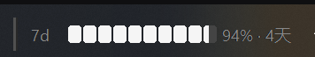

[简体中文](README.md) | [English](README_EN.md)


[](https://opensource.org/licenses/MIT)

# Codex Usage Monitor



A lightweight Windows usage monitor for the Codex CLI. It keeps current usage and reset countdowns visible directly in the taskbar.

## Highlights

- Shows the Codex 5-hour and 7-day usage windows in the taskbar; the deprecated 5-hour window might no longer be returned by Codex
- Supports Used and Remaining display modes, plus a space-saving Compact Mode
- Supports drag positioning, moving between taskbars, tray-based visibility, system themes, and DPI scaling
- Includes settings for refresh frequency, startup, language, usage windows, and application updates
- Optionally shows community model recommendations from [CodexRadar](https://codexradar.com/); this feature is disabled by default

## Requirements

- Windows 10 or Windows 11
- Codex CLI installed and signed in

## Quick start

Download `codex-usage-taskbar-monitor.exe` from [Releases](https://github.com/LiarCoder/codex-usage-taskbar-monitor/releases), place it in a folder writable by your user account, and run:

```powershell
codex-usage-taskbar-monitor
```

Left-click the tray icon to show or hide the Widget. Right-click the Widget or tray icon to open the menu.

## Documentation

| Topic | Covers |
| --- | --- |
| [Usage display](docs/en-US/usage-display.md) | Usage windows, percentage modes, reset countdowns, Compact Mode, and tray display |
| [Widget and settings](docs/en-US/widget-and-settings.md) | Taskbar positioning, interactions, refresh, language, startup, and updates |
| [CodexRadar](docs/en-US/codex-radar.md) | Recommendation sources, scoring, caching, and activation |
| [Diagnostics and privacy](docs/en-US/diagnostics-and-privacy.md) | Credentials, logs, local files, network access, and privacy boundaries |

## Privacy

The application does not upload project files, collect analytics, or directly edit `auth.json`. CodexRadar connects to the network only after you explicitly enable it. See [Diagnostics and privacy](docs/en-US/diagnostics-and-privacy.md) for details.

## License

[MIT](LICENSE)
