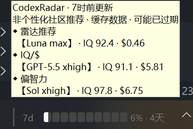

[返回中文 README](../../README.md) | [English](../en-US/codex-radar.md)

# CodexRadar 推荐

CodexRadar 是一个可选的实验性增强功能，用于显示非个性化的社区模型与推理强度推荐。该功能默认关闭，不影响核心用量监控。

## 启用与使用

在“设置 > CodexRadar > 启用 CodexRadar”中开启功能。首次开启时，应用会先显示隐私提示；只有确认后才会向 CodexRadar 发送请求。

启用后，将鼠标停在小工具内容区域约 500 毫秒即可查看推荐。左侧拖动把手不触发提示。还可以通过菜单打开网站，或者在小工具内容区域快速三击直接打开。

## 推荐显示

| 显示项 | 选择方式 |
| --- | --- |
| 速度位 / 聪明位 | 当接口返回明确的 `speed` / `smart` 槽位时分别显示；旧版 `value` 推荐兼容为速度位 |
| 社区日常推荐 | 当接口返回没有槽位的 `daily_development` 列表时，按原顺序展示，不推断每一项的位置语义 |
| 日常推荐 | 从原始效率数据中筛选 IQ ≥ 90 且价格、耗时有效的组合，按 `价格相对成本 ^ 0.7 × 时间相对成本 ^ 0.3` 选择最低者；成本相同时优先可信 IQ |
| 难题推荐 | 筛选 IQ ≥ 90、价格 ≤ $9、耗时 ≤ 30 分钟的组合；以 $8 和 30 分钟为目标，可信 IQ 相差至少 10 分时选择更高者，否则选择日常成本更低者 |

日常推荐使用 CodexRadar 原始效率接口中的任务通过率、平均价格和平均耗时。显示原始 IQ，排序时使用 95% Wilson 下置信界得到的可信 IQ，以降低小样本波动影响。社区数据不会根据你的账户实际可用模型进行筛选，因此推荐组合可能无法在当前账户中使用。

## 刷新、缓存与故障

- 完整刷新成功后约每小时更新一次；菜单中的手动刷新有 60 秒冷却时间
- 两个推荐数据源分别缓存和校验，完整响应不会原样保存
- 缓存最长保留 24 小时；刷新失败时会标记缓存可能过期，并逐步延长重试间隔
- CodexRadar 请求失败、数据过期或接口格式不兼容时，核心 Codex 用量轮询仍会继续工作

应用不会向 CodexRadar 发送 Codex Token、用量数据或项目内容。完整联网说明见[诊断与隐私](diagnostics-and-privacy.md)。
