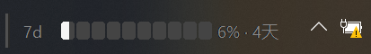
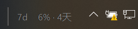

[返回中文 README](../../README.md) | [English](../en-US/usage-display.md)

# 用量显示

Codex 用量监控把 Codex 返回的限额百分比和重置倒计时显示在 Windows 任务栏中。小工具只展示接口当前提供且在设置中启用的窗口。

## 用量窗口

- `7d`：7 天用量窗口
- `5h`：已弃用的 5 小时用量窗口。Codex 当前可能不再返回该窗口，因此即使设置中已启用也可能不显示

可以在“设置 > 用量窗口”中选择需要显示的窗口。至少会保留一个选项，避免两个窗口同时关闭。

## 已使用与剩余

“设置 > 用量显示”提供两种模式：

- **已使用**：百分比和高亮色块表示已经消耗的用量，这是默认模式
- **剩余**：百分比和高亮色块表示仍可使用的用量

两种模式都会显示距离限额重置的时间，并同步影响任务栏小工具、托盘图标徽标和托盘提示文字。

所有语言统一使用紧凑的 ASCII 倒计时格式，最多显示两个非零单位，例如 `4d17h`、`17h25m`、`25m49s` 或 `49s`。将鼠标停在小工具或托盘图标上，可以查看按 Windows 本地时区显示的精确重置时间，格式为 `YYYY-MM-DD HH:MM`。

## 紧凑模式

紧凑模式会隐藏分段百分比条，仅保留窗口、百分比和重置倒计时，适合任务栏空间较紧张的场景。

## 托盘显示

托盘图标会显示当前首选可用窗口的百分比徽标：优先使用已启用且可用的 5 小时窗口，否则使用 7 天窗口。将鼠标停在托盘图标上，可以查看所有已启用且可用窗口的用量信息。
