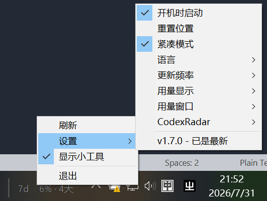

[返回中文 README](../../README.md) | [English](../en-US/widget-and-settings.md)

# 小工具与设置

## 任务栏位置与交互

- 拖动小工具左侧的竖向把手可以调整它在任务栏中的位置
- 将小工具拖到另一块屏幕的任务栏上，可以切换它所属的任务栏
- 左键单击托盘图标可以显示或隐藏小工具
- 右键单击小工具或托盘图标可以打开菜单
- CodexRadar 启用后，在左侧把手以外的区域快速三击会打开 CodexRadar 网站

位置、目标任务栏和显隐状态会保存在设置文件中。“设置 > 重置位置”可将小工具恢复到默认位置。

## 菜单设置

| 设置 | 行为 |
| --- | --- |
| 刷新 | 立即重新读取 Codex 用量 |
| 更新频率 | 在 1 分钟、5 分钟、15 分钟和 1 小时之间选择；默认 15 分钟 |
| 用量显示 | 在“已使用”和“剩余”之间切换 |
| 用量窗口 | 控制 5 小时和 7 天窗口的显示 |
| 紧凑模式 | 隐藏分段百分比条，缩短小工具宽度 |
| 开机时启动 | 为当前用户注册或移除 Windows 启动项 |
| 语言 | 跟随系统语言，或手动选择应用内置语言 |
| GitHub | 打开项目 GitHub 仓库主页 |
| 显示小工具 | 在不退出应用的情况下切换任务栏小工具 |

应用会跟随 Windows 的深浅色主题和 DPI，并在显示器配置、DPI、系统主题或 Explorer 状态变化后重新定位和渲染。

## 应用更新

应用每天自动检查一次 GitHub Releases，也可以从版本菜单项手动检查。检测到更新后：

- 便携版会下载新的可执行文件并通过更新辅助程序替换当前版本，然后重新启动
- 从 WinGet 安装的版本会调用 WinGet 完成升级，然后重新启动

设置会保存在 `%APPDATA%\CodexUsageTaskbarMonitor\settings.json`。
